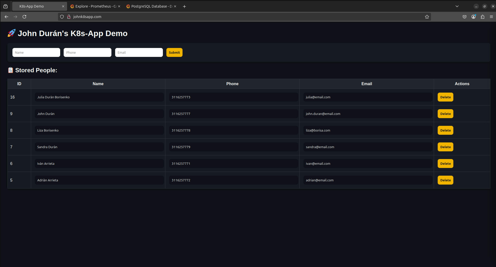
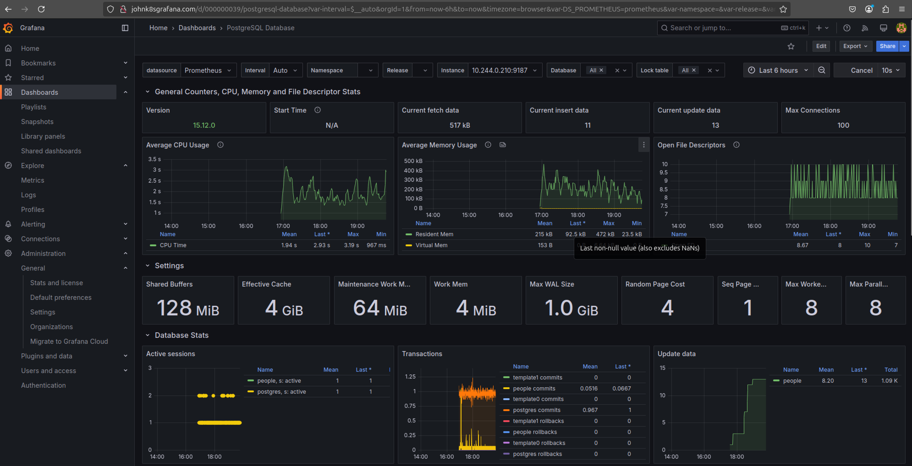
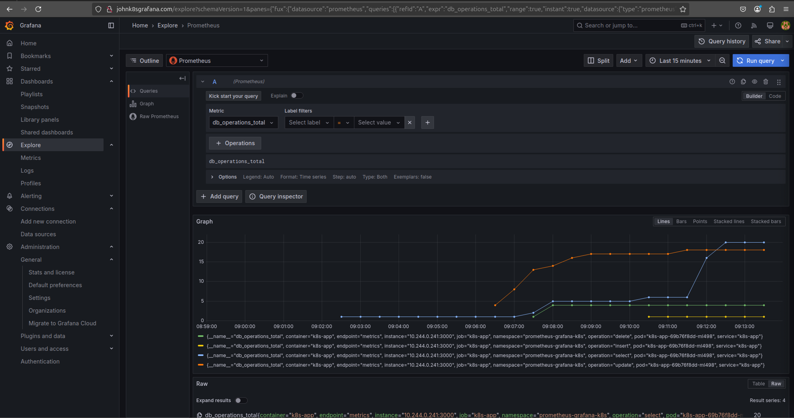
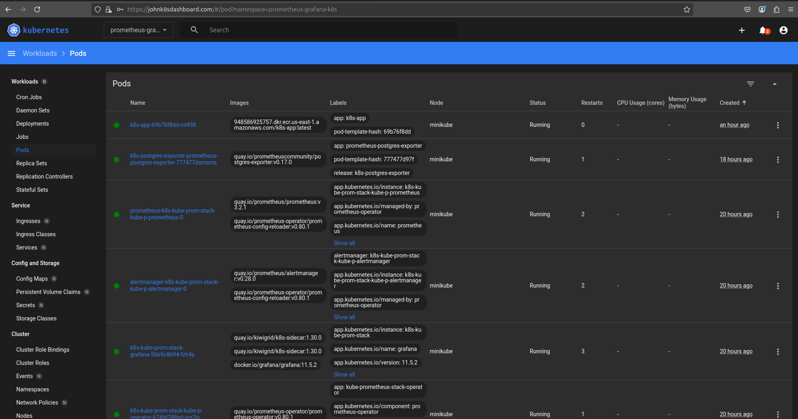

# Prometheus-Grafana-K8s Project

## Minikube Setup

**Prerequisites:**

-   Minikube along with a hypervisor like VirtualBox or Hyperkit.
-   If you plan to run Minikube on VirtualBox, ensure your virtual machine is configured with a minimum of:
    - 8GB of RAM
    - 4 vCPUs
-   AWS CLI (Amazon Web Services Command Line Interface)
-   Terraform

## Minikube Setup

### Deployments

This project deploys the following components:

-   **Node.js App:** A web application that allows users to upload and retrieve images, utilizing a PostgreSQL database for storage. NOTE: The scope of the project doesn't comprise development skills about the application itself. This is intended to show the configuration of Grafana and Prometheus as well as the configuration to scrape metrics. 
-   **PostgreSQL:** A robust relational database management system used to persist image data.
-   **Prometheus:** A powerful monitoring and alerting toolkit that collects metrics from the deployed applications and infrastructure.
-   **Grafana:** A data visualization and monitoring tool that provides dashboards to visualize metrics collected by Prometheus.

### How to Run

1.  **Start Minikube:**

    Begin by starting your Minikube cluster:

    ```bash
    minikube start
    ```

2.  **Prepare the Node.js Application Image:**

    Before deploying the Node.js application, ensure it is properly initialized:

    1.  Navigate to the `app` directory:

        ```bash
        cd app
        ```

    2.  Initialize a Node.js project:

        ```bash
        npm init -y
        ```

    3.  Install the required dependencies:

        ```bash
        npm install express ejs multer pg
        ```

    4.  Apply Terraform to push the Docker image to ECR:

        ```bash
        cd ./terraform && terraform init && terraform apply -auto-approve
        ```

        Obtain the repository name from the Terraform output and update the `repository` value in `./app/k8s/values.override.yaml`. Note that `values.yaml` is a placeholder and should not be modified.

3.  **Create the Kubernetes Namespace:**

    Create a dedicated namespace for the project:

    ```bash
    kubectl apply -f ./k8s/namespace.yml
    # or
    kubectl create namespace prometheus-grafana-k8s
    ```

    You can also set the current namespace for `kubectl` commands:

    ```bash
    kubectl config set-context --current --namespace=prometheus-grafana-k8s
    ```

4.  **Deploy PostgreSQL:**

    Deploy the PostgreSQL database using Helm:

    ```bash
    helm install k8s-postgres ./postgres/k8s -f ./postgres/k8s/values.override.yaml -n prometheus-grafana-k8s
    ```

    **Note:** If desired, you can set the current namespace as the default for `kubectl` using the command provided above.

5.  **Authenticate with ECR:**

    If your Node.js application image is hosted on ECR, authenticate with the registry. This example uses the AWS CLI for simplicity:

    ```bash
    aws ecr get-login-password --region us-east-1 | \
    kubectl create secret docker-registry ecr-registry-credentials \
    --docker-server=<AWS_ACCOUNT_ID>.dkr.ecr.us-east-1.amazonaws.com \
    --docker-username=AWS --docker-password=$(aws ecr get-login-password --region us-east-1) \
    -n prometheus-grafana-k8s
    ```

    **Note:** ECR login credentials expire after 12 hours and need to be refreshed.

6.  **Deploy the Node.js Application:**

    Deploy the Node.js application using Helm:

    ```bash
    helm install k8s-app ./app/k8s -f ./app/k8s/values.override.yaml -n prometheus-grafana-k8s
    ```

    The application will automatically create the necessary database tables if they do not exist.

    Verify that the PostgreSQL and Node.js application pods are running:

    ```bash
    helm list
    kubectl get pod
    ```

    Example output:

    ```
    john@john-VirtualBox:~/prometheus-grafana-k8s$ helm list
    NAME        	NAMESPACE             	REVISION	UPDATED                                	STATUS  	CHART         	APP VERSION
    k8s-app     	prometheus-grafana-k8s	5       	2025-03-01 20:25:44.424525028 -0500 -05	deployed	k8s-app-0.1.0 	1.0.0
    k8s-postgres	prometheus-grafana-k8s	1       	2025-03-01 19:21:49.420486707 -0500 -05	deployed	postgres-0.1.0	15.0
    john@john-VirtualBox:~/prometheus-grafana-k8s$ kubectl get pod
    NAME                       READY   STATUS    RESTARTS   AGE
    k8s-app-547dbf6dcc-2n7bk   1/1     Running   0          13m
    postgres-7c9886f7d-tr8bx   1/1     Running   0          77m
    john@john-VirtualBox:~/prometheus-grafana-k8s$
    ```

7.  **Access the Node.js Application:**

    Since the services do not have external IPs by default, you can access the application by forwarding the traffic to your local machine:

    ```bash
    kubectl port-forward deployment/k8s-app 3000:3000 -n prometheus-grafana-k8s
    ```

    Then, open your browser and navigate to `http://localhost:3000`.

    Alternatively, you can get the Minikube service URL:

    ```bash
    minikube service list
    ```

    And access the service using the URL in your browser.

    Example output:

    ```
    john@john-VirtualBox:~/prometheus-grafana-k8s$ kubectl get service
    NAME               TYPE        CLUSTER-IP       EXTERNAL-IP   PORT(S)        AGE
    k8s-app            NodePort    10.96.94.12      <none>        80:32442/TCP   78m
    postgres-service   ClusterIP   10.107.244.218   <none>        5432/TCP       78m
    john@john-VirtualBox:~/prometheus-grafana-k8s$ minikube service list
    |------------------------|------------------------------------|--------------|---------------------------|
    |       NAMESPACE        |                NAME                | TARGET PORT  |            URL            |
    |------------------------|------------------------------------|--------------|---------------------------|
    | default                | kubernetes                         | No node port |                           |
    | ingress-nginx          | ingress-nginx-controller           | http/80      | [http://192.168.49.2:31532](http://192.168.49.2:31532) |
    |                        |                                    | https/443    | [http://192.168.49.2:30579](http://192.168.49.2:30579) |
    | ingress-nginx          | ingress-nginx-controller-admission | No node port |                           |
    | kube-system            | kube-dns                           | No node port |                           |
    | prometheus-grafana-k8s | k8s-app                            |           80 | [http://192.168.49.2:32442](http://192.168.49.2:32442) |
    | prometheus-grafana-k8s | postgres-service                   | No node port |                           |
    |------------------------|------------------------------------|--------------|---------------------------|
    john@john-VirtualBox:~/prometheus-grafana-k8s$
    ```

    As you can see, port 32442 was assigned to Minikube, and the node can be accessed from `http://192.168.49.2:32442` in your local machine's web browser.
    
8.  **Update the Node.js Application:**

    When you make changes to the Node.js application code (`app.js`), rebuild the Docker image and apply the changes using Terraform. Then, restart the deployment:

    ```bash
    kubectl rollout restart deployment k8s-app -n prometheus-grafana-k8s
    ```

    The changes will be reflected in the application.

    Example:

    ```
    john@john-VirtualBox:~/prometheus-grafana-k8s$ kubectl rollout restart deployment k8s-app -n prometheus-grafana-k8s
    deployment.apps/k8s-app restarted
    john@john-VirtualBox:~/prometheus-grafana-k8s$ kubectl get pod
    NAME                       READY   STATUS              RESTARTS   AGE
    k8s-app-547dbf6dcc-2n7bk   1/1     Running             0          60m
    k8s-app-68456754bb-mvb9g   0/1     ContainerCreating   0          3s
    postgres-7c9886f7d-tr8bx   1/1     Running             0          124m
    john@john-VirtualBox:~/prometheus-grafana-k8s$
    ```

    The IP mapping won't change; just refresh the page in your web browser.

    At this point, you can view the application, open pgAdmin, and run queries against the database.

9.  **Install and Configure Ingress Controller:**

    Install the Nginx Ingress Controller to expose services externally. Ingress acts as a DNS, routing traffic to internal services based on domain names and paths.

    ```bash
    minikube addons enable ingress
    ```

    The Ingress Controller is installed in the `ingress-nginx` namespace.

    ```bash
    kubectl get namespace
    kubectl get pod -n ingress-nginx
    ```

    Example output:

    ```
    NAME                     STATUS   AGE
    default                  Active   179d

    NAME                                        READY   STATUS      RESTARTS      AGE
    ingress-nginx-admission-create-sfxbb        0/1     Completed   0             24h
    ingress-nginx-admission-patch-kn8pd         0/1     Completed   1             24h
    ingress-nginx-controller-768f948f8f-x2l2n   1/1     Running     1 (12h ago)   24h
    ```

    Add the Ingress configuration to `ingress/k8s-app-ingress.yaml`:

    ```yaml
    apiVersion: networking.k8s.io/v1
    kind: Ingress
    metadata:
      name: k8s-app-ingress
      namespace: prometheus-grafana-k8s
      annotations:
        nginx.ingress.kubernetes.io/rewrite-target: /
    spec:
      ingressClassName: nginx
      rules:
      - host: johnk8sapp.com
        http:
          paths:
          - path: /
            pathType: Prefix
            backend:
              service:
                name: k8s-app
                port:
                  number: 80
    ```

    Deploy the Ingress resource:

    ```bash
    helm install k8s-ingress ingress/ -n prometheus-grafana-k8s
    ```

    Check the IP assigned to the Ingress:

    ```bash
    minikube service list
    ```

    Add the domain mappings to your `/etc/hosts` file:

    ```bash
    echo -e "192.168.49.2\tjohnk8sapp.com" | sudo tee -a /etc/hosts
    ```

    Now, you can access the application via `http://johnk8sapp.com/`.

    Repeat this for the other GUIs:

    ```bash
    kubectl get ingress
    ```

    Example output:

    ```
    NAME                        CLASS   HOSTS                   ADDRESS        PORTS   AGE
    k8s-app-ingress             nginx   johnk8sapp.com          192.168.49.2   80      16s
    k8s-grafana-ingress         nginx   johnk8sgrafana.com      192.168.49.2   80      16s
    k8s-pgadmin-ingress         nginx   johnk8spgadmin.com      192.168.49.2   80      16s
    k8s-prometheus-ui-ingress   nginx   johnk8sprometheus.com   192.168.49.2   80      16s
    ```

    Add the corresponding host entries:

    ```bash
    echo -e "192.168.49.2\tjohnk8spgadmin.com" | sudo tee -a /etc/hosts
    echo -e "192.168.49.2\tjohnk8sprometheus.com" | sudo tee -a /etc/hosts
    echo -e "192.168.49.2\tjohnk8sgrafana.com" | sudo tee -a /etc/hosts
    ```

10. **Install Prometheus and Grafana:**

    Install the `kube-prometheus-stack` Helm chart:

    ```bash
    helm install k8s-kube-prom-stack prometheus-community/kube-prometheus-stack \
      --namespace prometheus-grafana-k8s \
      -f ./prometheus-grafana-stack/values-kube-stack.yaml
    ```

    The release name `k8s-kube-prom-stack` will be used in the ServiceMonitor for Prometheus to scrape metrics.

11. **Configure Metrics Exporters:**

    Configure metrics exporters for PostgreSQL and the Node.js application. There are several ways to export metrics:

    1.  Export metrics in the application using a Prometheus client library.
    2.  Add Prometheus annotations to the Kubernetes deployment.
    3.  Use a sidecar container to export metrics.
    4.  Use a dedicated metrics exporter.
    5.  Use ServiceMonitors/PodMonitors.
    6.  Manually configure scrape jobs.
    7.  Use Pushgateway.

    I'll use Exporters

    **Install PostgreSQL Exporter:**

    ```bash
    helm install k8s-postgres-exporter prometheus-community/prometheus-postgres-exporter -f ./exporters/postgres-exporter-values.override.yaml -n prometheus-grafana-k8s
    ```

    Access the exporter's web page by forwarding the port:

    ```bash
    kubectl get svc | grep -i exporter
    kubectl port-forward svc/k8s-postgres-exporter-prometheus-postgres-exporter 9187:80
    ```

    Check if the exporter has detected PostgreSQL by visiting `http://localhost:9187/metrics`. Look for `pg_up 1`.

    you should see something along these lines: 
    ```bash
    # HELP pg_up Whether the last scrape of metrics from PostgreSQL was able to connect to the server (1 for yes, 0 for no).
    # TYPE pg_up gauge
    pg_up 1
    ```

    Deploy a ServiceMonitor for the PostgreSQL exporter:

    ```yaml
    serviceMonitor:
      enabled: true
      labels:
        release: prometheus
    ```

    Verify the ServiceMonitor deployment:

    ```bash
    kubectl get servicemonitor
    ```
    Now, you add a nice dashboard from https://grafana.com/grafana/dashboards/455-postgres-overview/

    

    **Add ServiceMonitor for Node.js App:**
    The metrics exported by the application really depends on you. I added metrics to count the total of requests and the count of type of requests to DB. This may be meaningless but it's out of the scope of this project.

    Create `exporters/k8s-app-exporter-values.yaml`:

    ```yaml
    apiVersion: monitoring.coreos.com/v1
    kind: ServiceMonitor
    metadata:
      name: k8s-app-monitor
      namespace: prometheus-grafana-k8s
      labels:
        release: k8s-kube-prom-stack
    spec:
      selector:
        matchLabels:
          app: k8s-app
      endpoints:
        - port: metrics
          path: "/metrics"
          interval: 30s
    ```

    Apply the ServiceMonitor:

    ```bash
    kubectl apply -f ./exporters/k8s-app-exporter-values.yaml
    ```
    You can leverage Loki to visualize the metrics or logs from the app

    
    
13. **Install Kubernetes Dashboard:**


    Install:
    ```bash
    kubectl apply -f https://raw.githubusercontent.com/kubernetes/dashboard/v2.7.0/aio/deploy/recommended.yaml
    ```

    Create Ingress:
    ```bash
    kubectl apply -f ingress/templates/k8s-dashboard.yaml -n kubernetes-dashboard
    ```

    Add the dns rrecord
    ```bash
    echo -e "192.168.49.2\tjohnk8sdashboard.com" | sudo tee -a /etc/hosts
    ```

    Create a TSL:
    ```bash
    openssl req -x509 -nodes -days 365 -newkey rsa:2048 -keyout dashboard.key -out dashboard.crt -subj "/CN=<your-dashboard-domain>/O=<your-organization>"
    ```

    Create a service account, role, and token:
    ```bash
    kubectl create sa kube-ds-admin -n kubernetes-dashboard
    kubectl create clusterrolebinding kube-ds-admin-role-binding --clusterrole=admin --user=system:serviceaccount:kubernetes-dashboard:kube-ds-admin
    kubectl create token kube-ds-admin -n kubernetes-dashboard
    ```

    Access the dashboard on the domain you defined in the ingress. e.g. johnk8sdashboard.com

    